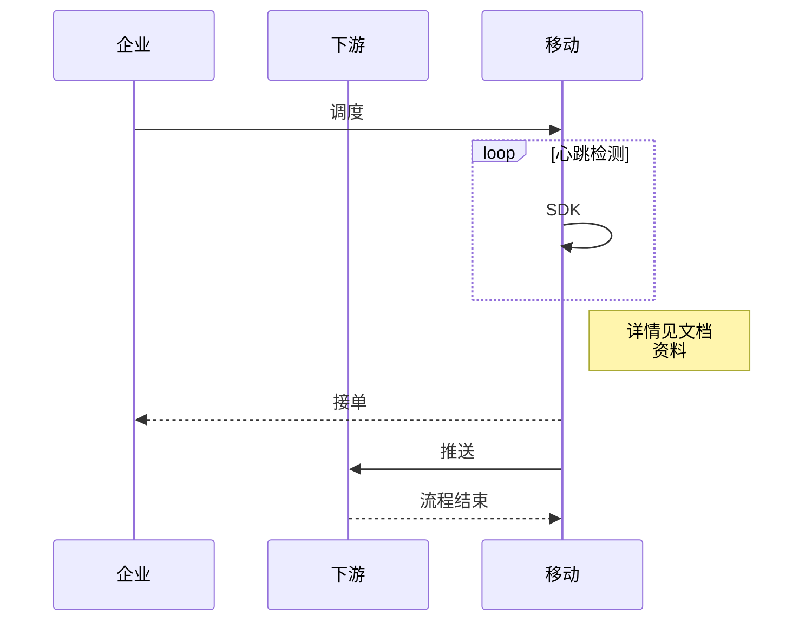

# Sequence Diagram

```mermaid
sequenceDiagram
participant 企业
participant 下游
participant 移动
企业->>移动: 调度 
loop 心跳检测
移动->>移动: SDK
end
Note right of 移动: 详情见文档 <br/>资料
移动-->>企业: 接单
移动->>下游: 推送
下游-->>移动: 流程结束
```

